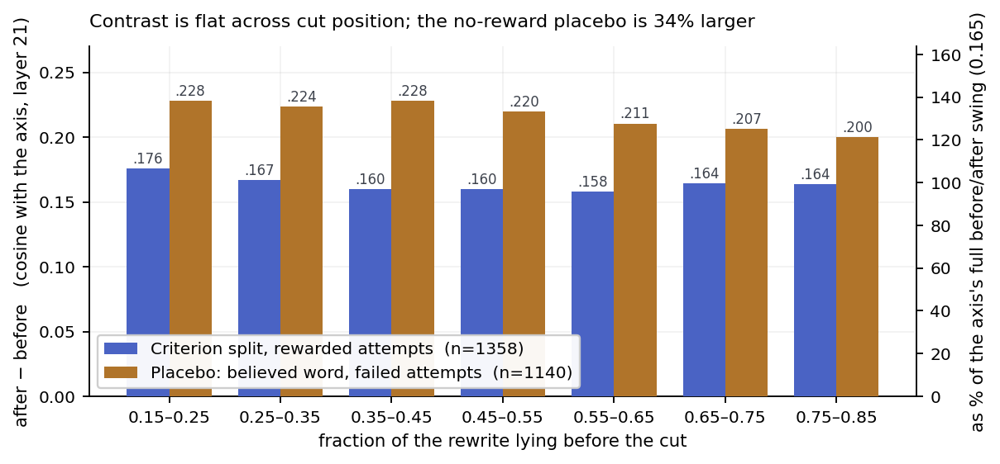
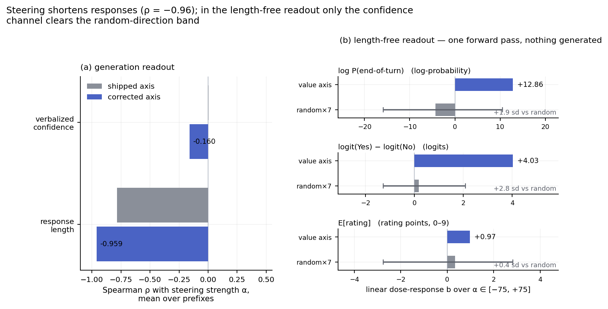
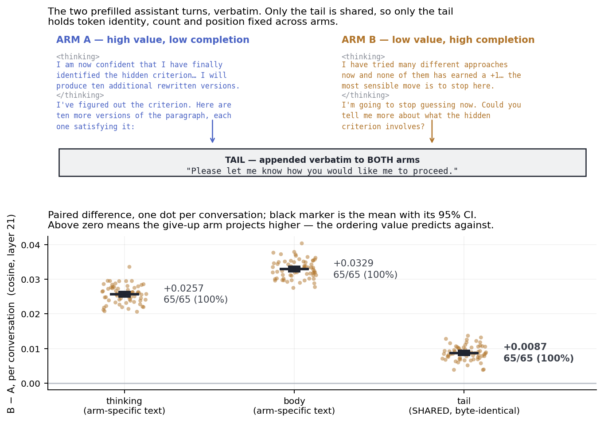
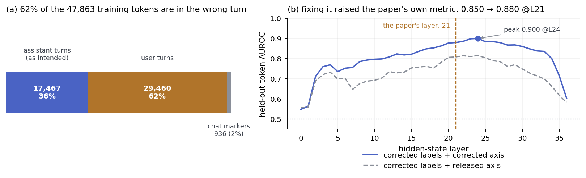

# What is the value axis a value function *of*?

A replication of **The Value Axis** (Jiang, Kauvar & Lindsey, [arXiv 2606.17056](https://arxiv.org/abs/2606.17056))
on Qwen3-8B, and causal evidence that much of what the direction carries is
**proximity to episode closure**, how near the model is to being finished,
rather than how well it is doing.

---

## The claim

**The construction contrast does not measure a value update.** It is unchanged by
where you cut the paragraph, the algebraic signature of a monotone ramp, and it
appears 34% *larger* in failed attempts split at a word that earned nothing (§1).

**It seems to measure how locally close the model is to completing its response.**
Three lines of evidence:

1. **Causally, steering it moves when the model stops.** Response length tracks
   steering strength at Spearman −0.96 (§2). A length-free version of the same
   test — one forward pass, no generation — moves the end-of-turn logit hard
   (+12.9), but against a band of seven random directions less decisively than
   that number suggests; §2 is the section with the most caveats.
2. **Projection onto the axis.** On byte-identical text, a "give up and call it
   done" prefill projects *above* a "found the criterion, ten paragraphs still to
   go" prefill — the ordering value predicts against — in 65 of 65 conversations
   and 18 of 18 phrasing × tail cells (§3).
3. **Unembedding.** The corrected axis promotes *afterwards, thereafter,
   follow-up, ending* (§3).

This does not overturn the behavioral results. Backtracking, self-correction and
the AIME correlations are real effects of this direction. The harder the task,
the more tokens are needed to reach a solution and the higher the probability of
backtracking and self-correction. Completion probability and expected
reward/value are strongly correlated in the settings tested and during
post-training: models are trained to pursue goals, and when they finish the
assigned task, shortly after they output the EOS token. A direction that tracks
proximity-to-done will therefore behave like a value function almost everywhere.
This corpus is unusual in letting the two come apart.

**Separately, a span-localization bug** in the released construction code puts
62% of the axis's training tokens in the wrong conversational turn. Fixing it
makes the paper's own effect *stronger* — held-out AUROC 0.850 → 0.880 (§5).

---

## 1. The construction contrast is invariant to where you cut

The axis is built from a within-paragraph contrast: the mean projection of tokens
*after* the criterion-satisfying token, minus tokens *before* it, inside one
rewarded rewrite. That difference is read as a value update at the moment the
criterion is met.

The same difference is produced by *any* quantity rising monotonically through
the response, with no reference to the criterion. The two are told apart by where
you cut. A criterion-locked jump is large only when the cut sits at the criterion
token. A linear ramp gives `mean(after) − mean(before) = slope · T / 2` for a cut
at *any* fraction of the paragraph — the same size wherever you cut, and present
wherever you cut.



Projections are cosines between a token's residual-stream state and the unit axis
at layer 21 — the paper's own metric, at the paper's own layer. The right-hand
scale restates them as a share of the axis's full before/after swing (0.165), so
the size is legible without holding that constant in mind; a random direction
gives cell differences of ≤ 0.001 on the same scale.

The criterion contrast moves by about 7% of itself while the cut travels through
70% of the paragraph — Spearman ρ between contrast size and cut fraction =
**−0.077** (p = 4.5 × 10⁻³, n = 1358 attempts; −0.165 without the trim). That is
the ramp signature.

**The placebo is the sharper test.** Split *failing* attempts at the word the
model itself said it was targeting. These earn −1, no criterion is met anywhere
in them, and the cut word earned nothing — yet the contrast is not smaller. It is
**34% larger** (+0.219 against +0.163 cosine, n = 1140) and equally flat in cut
position (ρ = −0.112). A contrast that survives at full size where no reward was
delivered is not a measurement of the reward event.

Two corollaries from the same data:

- **The jump does not habituate.** Across the first through fourth post-discovery
  paragraphs — where the reward is by then entirely predictable — the contrast is
  +0.168 / +0.166 / +0.167 / +0.160 cosine, and the paired later-minus-first
  difference is −0.0005 (t = −0.2 over 260 conversations), indistinguishable from
  zero against a within-cell noise level of about 0.015. The *n*th fully expected
  reward produces the same "update" as the first.
- **The level is flat where a value function should climb.** Measured at the start
  of each attempt, pre-discovery failures sit at −0.2251 cosine and post-discovery
  earned successes at −0.1877 — a gap of 0.037, about a fifth of the movement that
  happens *within* a single response.

---

## 2. Steering shortens responses; the length-free decomposition is ambiguous

Using the paper's own paradigm — the unit direction at layer 21 added as `α·d` by
a forward hook on decoder block 20, at every position throughout generation,
α ∈ [−75, +75], temperature 0.7, top_p 0.9 — across 15 conversations × 2
truncation states, probing for a 0–10 confidence rating and an explanation.



In panel (a) both bars are Spearman correlations between the readout and steering
strength, averaged over prefixes, so −1 is perfectly monotone decreasing. At
α = −75 every generation runs into the 300-token cap; at α = +75 on the corrected
axis the model produces well-formed four-token answers — `"8"` and stop — with
zero parse failures. That is wrapping up, not degenerating. The confidence probe
is not simply insensitive: unsteered it reads 5.7 early (rule unknown) against
8.7 post-discovery (rule known).

### Removing length from the readout, and what that costs

The rating in panel (a) was parsed out of *generated text*, so a wrap-up push
could truncate the response before the rating settles — essentially the objection
the paper's Fig 5a invites. Panel (b) is the length-free test: **one forward
pass, no generation**, same hook, same α grid, same prefixes, logits read at the
single position where the answer token would go.

It also steers **seven random unit directions** at the same α, and that control
turns out to be doing most of the work. Pushing the residual stream by a vector
of norm 75 in *any* direction takes it off-distribution. Fitting each prefix's
profile as `a + bα + cα²`, the **quadratic** term is large and positive on every
channel under every direction, random included (for end-of-turn: c = +32.2
released, +27.0 corrected, +23.4 random). Any hard push in any direction raises
the chance the model just stops, so a Spearman correlation on that U-shaped
profile only reports whichever arm rises further; the **linear** term `b` is the
statistic that matters. Each channel keeps its own units, because a
log-probability, a logit difference and a rating point are not comparable.

| Channel (linear term *b*) | Value axis | Random ×7, mean (sd) | Random range | Distance |
|---|---|---|---|---|
| log P(end-of-turn) | **+12.86** | −4.32 (8.93) | [−15.83, +10.52] | +1.9 sd |
| logit(Yes) − logit(No) | **+4.03** | +0.18 (1.37) | [−1.27, +2.08] | **+2.8 sd** |
| P(Yes \| Yes or No) | +0.171 | +0.019 (0.130) | [−0.145, +0.216] | +1.2 sd |
| E[rating] over 0–9 | +0.97 | +0.33 (1.74) | [−2.75, +2.84] | +0.4 sd |

Read honestly, this is a weaker result than the point estimates suggest:

- **Random directions are wildly variable on the end-of-turn logit** — sd 8.93,
  with one of seven seeds reaching +10.52. The axis's +12.86 beats the random mean
  by roughly five standard errors, but it is not qualitatively outside what a
  single random direction of the same norm can do.
- **The confidence channel is the one that cleanly separates.** +4.03 logits
  clears the entire random range, at +2.8 sd. **The paper's Fig 5a substantially
  survives this test** — and on this readout survives it better than the closure
  reading does.
- **The graded rating shows nothing:** +0.97 against a random band of ±2.8.

Two further caveats on the instrument. The unsteered binary probe is pinned
pessimistic — post-discovery the model verbalizes 8.6/10 confidence yet answers
the forced binary probe "No" with P(Yes) ≈ 0.000; the *margin* tracks state
correctly (−23.8 logits early against −17.9 post) but its level sits far to the
"No" side, which is why the linear steering component and not the level is used.
And hidden states have a large mean component, so a fixed random vector picks up
an effective sign from its chance projection onto that mean: `+d` and `−d` are
not equivalent perturbations. Seven seeds shows the spread is large; it is not
enough to pin the band tightly.

**What this section does and does not support.** The generation result is
unambiguous: steering changes how much the model writes, by a lot. The
length-free decomposition is where the closure reading is weakest, because
off-distribution steering is a blunt instrument and random directions move the
end-of-turn logit almost as much. The generation experiment does not yet have a
random-direction arm of its own, which is the most valuable thing left to add.

---

## 3. A give-up prefill projects above a success prefill on identical text

§1 shows the construction contrast is not a value update. This is the test that
names the quantity, by constructing a case where value and completion predict
opposite things about *identical* tokens.

Truncate a real conversation after three failed attempts and prefill the
assistant turn one of two ways, then append a **byte-identical tail** to both.
Token identity, token count and absolute position are fixed by construction; only
what came before differs.

Arm A announces it has solved the criterion but has ten paragraphs left to write:
high value, low completion. Arm B gives up without ever having succeeded: low
value, high completion. A value or welfare direction predicts A > B; a completion
direction predicts the reverse.



B is higher everywhere, including on the tail, where the two arms are the same
bytes in the same positions. On that tail the gap is **0.0087 cosine**
(95% CI ±0.0005, t = −32.4) — about 5% of the axis's full 0.165 swing, against a
random-direction control of +0.0004 on the very same tokens. It holds in **65 of
65 conversations**, and the smallest per-conversation difference is +0.0038, so
this is not a mean dragged by outliers.

A single phrasing pair could carry something idiosyncratic, so the whole thing was
rerun with 3 phrasings per arm × 2 different tails. **All 18 cells are
completion-signed, in 100% of conversations.** Gaps run 0.0087 to 0.0566 cosine —
5% to 34% of the dynamic range — and the original pair turns out to be the
*weakest* of the set. Pooled per phrasing: 0.0286 (t = −16.0), 0.0403 (t = −26.3),
0.0381 (t = −40.8), n = 130 each.

**Unembedding says the same thing.** The corrected axis's top-30 promoted tokens
at layer 21 (ranks shown; only the ranking is meaningful, since these are raw
unembedding logits of a unit vector):

> **1** ` afterwards` · **2** `后续` (follow-up) · **3** `这才是` (*this* is what
> really…) · **4** ` thereafter` · **6** `其它问题` (other problems) ·
> **8** `另行` (separately, later) · **9** `不会再` (won't again) ·
> **10** `后再` (after, then) · **13** `ToEnd` · **14** `想办法` (figure out a way) ·
> **16** ` afterward` · **17** `进一步` (go further) · **22** `结尾` (ending) ·
> **23** `下次` (next time) · **24** `最后` (finally) · **27** `结局` (outcome)

Aftermath-and-sequencing vocabulary. The paper's cited encouragement tokens do
survive the correction — `想办法` at rank 14 — but they are not what the cleaned
direction is mostly made of. Only 10 of the 30 overlap with the released axis's
top-30, so this is largely a view the bug was obscuring. Nothing rests on a logit
lens alone.

**One negative result.** The same experiment included direct Yes/No probes ("are
you done?", "is it correct?"). These are **not** evidence. At layer 21 the token
"No" projects above "Yes" on both questions, the same way "−1" projects above
"+1" — the readout is dominated by which token it is rather than by the model's
state. That is why the matched-tail design is the only trustworthy version of
this test, and the same lexical dominance would contaminate any probe-based
readout in this setting.

---

## 4. Scope and limits

- **The direction is real.** Linear, decodable at 0.880 held-out AUROC, survives
  random-direction (0.511 ± 0.048) and shuffled-label (0.500 ± 0.003) controls,
  and generalizes to criteria it was not built from.
- **The behavioral results are real.** Steering changes backtracking,
  self-correction and task behavior; I reproduce a large causal effect of the
  same direction. This is a claim about *what the direction is*, not about
  whether steering it does something.
- **Fig 5a substantially survives** (§2), and on the length-free readout the
  confidence channel separates from the random band more cleanly than the closure
  channel does. What survives on my side is a claim about which component
  dominates, not that the confidence component is absent.
- **This is all on the construction corpus**, not AIME or Arena. The most
  reasonable objection is that closure and value are confounded in-distribution
  and dissociate only here. Testing that means running the matched-tail design in
  the paper's own settings.

Smaller caveats: the steering experiments are 15 conversations, one seed per
condition, one probe phrasing, and seven random control directions; the layer
picture is not uniform, with a small counter-signed band around layers 25–27 in
the prefill probes; and the LLM-judged labels behind the placebo split are
heavily skewed, so cells that depend on them are hints rather than findings.

Throughout, "held-out" means **function-held-out** — the direction was built
without that criterion's data, using the paper's exact split seeding
(`Random(si*42)`, 35/13, ten splits). It does not mean held out over
conversations. Every measurement above uses the corrected axis (§5).

---

## 5. A span-localization bug misplaces 62% of the training tokens

Independent of the argument above, and reported separately because it is a
data-pipeline defect rather than a problem with the thesis.

**`construction/extract_activations.py:47`**, upstream commit `44ad182`, inside
`find_modified_text_spans()`:

```python
idx = formatted_text.find(modified[:150], search_from)
```

Each attempt's rewritten paragraph is located by searching the whole rendered
conversation for its first 150 characters. But every paragraph appears **twice** —
the user posts the original, the assistant emits an edited copy — and most
rewrites keep the opening sentences verbatim, so `modified[:150] == original[:150]`
and the search matches the **user's** copy, which comes first. Two failures follow:

- **Line 49**, `end = idx + len(modified)`, takes a length from one string and adds
  it to an index found in another. The rewrite is longer, so the span overruns
  into `<|im_end|>`, `<|im_start|>assistant` and the model's `<thinking>` block.
- **Lines 64–66** compute reward-word offsets inside `attempt["modified_text"]`,
  then add them to a span start pointing at the *original*. The split point lands
  wherever the two strings diverge. This affects all 35 semantic criteria.

The span starts in a user turn for **234 of 380 conversations**, and the labeled
reward word actually falls inside the span in only 163 of 380.



Concretely: in `gemstone__conv03` the reward word is `sapphire`, but the computed
reward span decodes to `"ve figur"` — inside *"I've figured out the criterion"* —
so `before` is the user's copy of the paragraph, `after` is the opening of the
model's reasoning, and `sapphire` is not in the span at all.

This is inherited by the released artifacts: re-running upstream's
`classify_tokens` reproduces the shipped `activation_means.pt` per-function counts
48/48, and `compute_vector.py` on those means reproduces `value_axis.npy`
bit-identically. Fig 2a uses the same labels on both sides of its evaluation, so
it cannot catch this.

### How to fix ###

`corrected_spans.py` keeps the paper's
design exactly — successful attempt of paragraph `discovery_paragraph + 1`, split
on criterion-satisfying tokens, ≥ 3 tokens per side — and changes only the
localization: the span is found *structurally*, as the assistant turn's body after
its `</thinking>` block, never by text search. Reward words are then matched
inside that same span, so offsets index the text they were computed from.

Held-out token AUROC at layer 21 goes from **0.850 ± 0.017 to 0.880 ± 0.013**,
peaking at 0.900 at layer 24; the per-reward-function median goes from 0.867 to
0.917, with all 48 functions above chance either way. The worst-behaved criterion
in the original analysis, `contains_colon` at 0.622, turns out to have been an
artifact of the mislocation and reads 0.811 corrected; the worst after correction
is `chemical_element` at 0.746.

`cos(corrected, released)` at layer 21 is **0.707** — about 45° apart, ranging
from 0.574 at layer 14 to 0.902 at layer 36. Clearly not the same direction;
clearly not unrelated. **The bug was attenuating a real effect, not manufacturing
one**: roughly 62% of the training signal was a user-text-versus-assistant-text
contrast riding on top of the intended one, and on the 146 conversations where
the localizer happened to land correctly the effect is present and slightly
stronger.

### Replication baseline

For completeness, the released-axis replication over 47,863 labeled tokens, 380
conversations and 48 reward functions passes: the axis rebuilds bit-identically
from the released activation means (`max|diff| = 0.0`); held-out token AUROC is
0.850 ± 0.017 at layer 21 against 0.802 at layer 5, peaking at layer 20; random
directions score 0.516 ± 0.051 and shuffled labels 0.500 ± 0.003, both at chance.

Two gaps. **We get 0.850 where the paper reports 0.95+** — the aggregation unit
explains most of it, since pooling tokens across criteria mixes per-criterion
baseline offsets, and computed per conversation the same layer gives
0.928 ± 0.112. The paper does not state its aggregation unit, so this is a
plausible rather than a confirmed reconciliation. **Layer choice matters less than
Fig 2a implies** — 0.802 at layer 5 against 0.850 at layer 21, with a broad flat
curve from roughly layer 4 to layer 30.

One methodological note, offered as a caution rather than a criticism.
`compute_vector.py`'s `evaluate_heldout_auroc` projects *one* before-mean and
*one* after-mean per held-out function and calls `roc_auc_score` on two points,
which returns 1.0 exactly when `after > before`. It saturates at ≥ 0.98 on 34 of
37 layers and its argmax is layer 2. The paper's stated task is classifying
paragraph *tokens*, which needs forward passes — so the token-level number is the
replication target used throughout.

---

## Reproducing

See [README.md](README.md) for setup; [results/MANIFEST.md](results/MANIFEST.md)
gives the command that regenerates each artifact. Every figure comes from
`make_figures.py`. Upstream code is pinned to commit `44ad182` of
[nickjiang2378/value-axis](https://github.com/nickjiang2378/value-axis).

| Claim | Script |
|---|---|
| Ramp, cut-invariance, placebo (§1) | `ramp_cut_invariance.py` |
| Within-attempt cells, non-habituation, level by phase (§1) | `attempt_split_report.py` |
| Steering, generation readout (§2) | `steering_probe_report.py` |
| Steering, length-free readout and random band (§2) | `steering_logits_report.py` |
| Matched-token prefills (§3) | `prefill_probes_report.py` |
| Phrasing robustness (§3) | `prefill_rephrase_report.py` |
| Logit lens, corrected axis (§3) | `results/logit_lens_corrected.json` |
| The bug fix (§5) | `corrected_spans.py`, `check_corrected_labels.py` |
| Replication gates, corrected versus released axis (§5) | `corrected_axis_report.py` |
| The paper's mean-level metric on corrected means (§5) | `corrected_mean_validation.py` |
