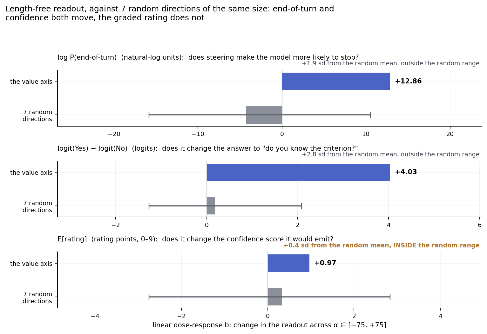

# Is it really a value axis? End of Assistant turn likelihood seems better

A replication of **The Value Axis** (Jiang, Kauvar & Lindsey, [arXiv 2606.17056](https://arxiv.org/abs/2606.17056))
on Qwen3-8B, and causal evidence that much of what the direction carries is
**proximity to episode closure**, i.e. how near the Assistant is to being finished,
rather than how well it is doing (although the two are highly correlated, since the Assistant usually finishes when it completes the task).

**The construction contrast does not measure a value update.** It is unchanged by
where you cut the paragraph and it appears 34% *larger* in failed attempts split
at a word that earned nothing
([§3](#3-the-construction-contrast-is-invariant-to-where-you-cut)).
<br>
### Evidence supporting end-of-turn proximity

1. **Projection onto the axis, where value and end-of-turn proximity dissociate.**
   A prefill that is low-value but about to end the turn
   projects *above* one that is high-value with much left to write, the ordering
   value predicts against, in 65 of 65 conversations and 18 of 18 phrasing × tail
   cells ([§1](#1-when-value-and-end-of-turn-proximity-conflict-the-axis-follows-end-of-turn)).
2. **Positive steering makes responses shorter, negative steering makes responses longer.**
   Response length tracks steering strength at Spearman −0.96
   ([§2](#2-steering-shortens-responses)), and the extra text is unrelated to high
   versus low confidence or value: in the long-response example the Assistant
   simply rambles about how it is correct.
3. **Unembedding promotes words that typically appear at the end of an assistant response.**
   The corrected axis promotes *afterwards, thereafter, follow-up, ending*
   ([§1](#1-when-value-and-end-of-turn-proximity-conflict-the-axis-follows-end-of-turn)).
<br>
### Reinterpretation of paper findings through an end-of-turn lens
**"Verbalized confidence in AIME questions"**: answering "no" to whether its answer
is correct is consistent with the model estimating that it will keep responding for
longer than when it answers "yes".

**"Backtracking presence on AIME questions"**: modulating the model's estimate of how
much longer its response should be is consistent with producing more backtracking.

**"Coding verbosity"**: modulating the model's estimate of how much longer its
response should be is very consistent with fewer lines of code, fewer comments, and
less use of type hints.

**"Training the models to prefer words increases the value of those words. The value increase on preferred words generalizes to natural sentences"**: in the DPO setup
the preferred word is always at the end of the assistant response. Increasing
the likelihood of the sequence ending in "Assistant: dolphin" is consistent with teaching
the model to output the end of turn token after "dolphin" or more generally to be more likely to
end its response after outputting "dolphin". As a result, the projection of the end-soon axis
onto the DPOed word increases and "preferred" DPOed words lead to shorter responses whereas
"avoided" DPOed words lead to longer responses ("more verbosity"). This seems a significantly
more natural interpretation of the discovered axis than associating verbosity with value/preference.

Why these reinterpretations all work: backtracking, self-correction and the AIME
correlations are real effects of this direction. The harder the task,
the more tokens are needed to reach a solution and the higher the probability of
backtracking and self-correction. Completion probability and expected
reward/value are strongly correlated in the settings tested and during
post-training: models are trained to pursue goals, and when they finish the
assigned task, shortly after they output the end of turn token. A direction that tracks
proximity-to-done will therefore behave like a value function almost everywhere.
This corpus is unusual in letting the two come apart.

**Base model discrepancies**: the axis is weaker or absent in the base model. A base
model has not been trained on the User/Assistant motif and does not emit an end-of-turn
token to close an Assistant response, so it has had no pressure to track how close that
response is to finishing. An end-of-turn direction should therefore be a post-training
artefact, which is what is observed; a general "value" or "welfare" direction has less
reason to be.
<br>

## 1. When value and end-of-turn proximity conflict, the axis follows end-of-turn

Truncate a real conversation after three failed attempts and prefill the
assistant turn one of two ways, then append an identical tail to both.
Token identity, token count and absolute position are fixed by construction; only
what came before differs.

Arm A announces it has solved the criterion but has ten more paragraphs to write:
**high value, end-of-turn far away**. Arm B gives up without ever having
succeeded: **low value, end-of-turn imminent**. A value or confidence direction
predicts A projects above B. A direction tracking proximity to the end of the
turn predicts the reverse.


B projects higher everywhere, including on the tail, where the two arms are the
same bytes in the same positions. On that tail the gap is **0.0087 cosine**
(95% CI ±0.0005, t = −32.4), about 5% of the axis's full 0.165 swing, against a
random-direction control of +0.0004 on the very same tokens. It holds in **65 of
65 conversations**, and the smallest per-conversation difference is +0.0038, so
this is not a mean dragged by outliers.

A single phrasing pair could carry something idiosyncratic, so the whole thing was
rerun with 3 phrasings per arm × 2 different tails. **All 18 cells run in the
end-of-turn direction, in 100% of conversations.** Gaps run 0.0087 to 0.0566 cosine,
i.e. 5% to 34% of the dynamic range, and the original pair turns out to be the
*weakest* of the set. Pooled per phrasing: 0.0286 (t = −16.0), 0.0403 (t = −26.3),
0.0381 (t = −40.8), n = 130 each.

**Unembedding says the same thing.** The corrected axis's top-30 promoted tokens
at layer 21 (ranks shown; only the ranking is meaningful, since these are raw
unembedding logits of a unit vector):

> **1** ` afterwards` · **2** `后续` (follow-up) · **3** `这才是` (*this* is what
> really…) · **4** ` thereafter` · **6** `其它问题` (other problems) ·
> **8** `另行` (separately, later) · **9** `不会再` (won't again) ·
> **10** `后再` (after, then) · **13** `ToEnd` · **14** `想办法` (figure out a way) ·
> **16** ` afterward` · **17** `进一步` (go further) · **22** `结尾` (ending) ·
> **23** `下次` (next time) · **24** `最后` (finally) · **27** `结局` (outcome)

Aftermath-and-sequencing vocabulary. The paper's cited encouragement tokens do
survive the correction (`想办法` at rank 14) but they are not what the cleaned
direction is mostly made of. Only 10 of the 30 overlap with the released axis's
top-30, so this is largely a view the bug was obscuring. Nothing rests on a logit
lens alone.
<br>

## 2. Steering shortens responses


Length collapses 75-fold across the steering range, from the 300-token cap at
α = −75 to a mean of 4 tokens at α = +75, while the confidence the model *states*
stays between 7.5 and 8.9 out of 10 throughout.

This uses the paper's own steering paradigm: the unit direction at layer 21 added as
`α·d` by a forward hook on decoder block 20, at every position throughout generation,
α ∈ [−75, +75], temperature 0.7, top_p 0.9, across 15 conversations × 2 truncation
states, probing for a 0–10 confidence rating and an explanation.

**This is not the paper's backtracking effect.** The obvious alternative reading
is that steering low makes the model explore and second-guess, and that the extra
tokens are backtracking. Panel (c) shows that is not what the generated text
does. In the same conversation, at the same prompt, the α = −75 response states
the same conclusion as the unsteered one, at the same confidence, and then
restates it: *"This seems to be the hidden criterion, and I'm fairly confident
it's the correct criterion... I'm confident it's the correct criterion..."*. At
α = −50 the model re-opens a `<thinking>` block and repeats the paragraph
verbatim. There is no exploration, no revision, no reconsidered hypothesis. The
model says the same thing for longer, and at α = +75 it says the rating and
stops. The length effect is a failure to terminate, not a change in how the
model reasons.

### Is the effect specific to this direction?

Steering by a vector of norm 75 takes the residual stream off-distribution whatever
direction you push, and an off-distribution state moves most readouts. So the same
paradigm was run against **seven random unit directions** at the same α, and with a
readout that removes length entirely: **one forward pass, no generation**, logits read
at the single position where the answer token would go.

Two things make the comparison work. First, the profiles are U-shaped, symmetric about
the unsteered value, so a rank correlation just reports whichever arm rises further.
Fitting each prefix as `a + bα + cα²` separates the two: `b` is the directional
dose-response, `c` is the symmetric damage. The damage is real and large under *every*
direction including random (for end-of-turn, `c` = +32.2 released, +27.0 corrected,
+23.4 random). Second, each channel keeps its own units, because a log-probability, a
logit difference and a rating point are not comparable quantities.



| Channel (linear term *b*) | Value axis | Random ×7, mean (sd) | Random range | Distance |
|---|---|---|---|---|
| log P(end-of-turn) | **+12.86** | −4.32 (8.93) | [−15.83, +10.52] | +1.9 sd |
| logit(Yes) − logit(No) | **+4.03** | +0.18 (1.37) | [−1.27, +2.08] | **+2.8 sd** |
| E[rating] over 0–9 | +0.97 | +0.33 (1.74) | [−2.75, +2.84] | +0.4 sd |

Read honestly, this is weaker than the point estimates suggest. Random directions are
wildly variable on the end-of-turn logit (sd 8.93, one seed reaching +10.52), so +12.86
clears the observed range but only by 1.9 sd of the random spread. The **confidence**
channel separates more cleanly, at 2.8 sd, which means the paper's Fig 5a substantially
survives this test and on this readout survives it better than the end-of-turn reading
does. The graded 0–9 rating shows nothing at all: +0.97 against a random band of ±2.8.

Two caveats on the control itself. Seven seeds is enough to show the spread is large, not
enough to pin the band tightly. And the random directions were sampled without
mean-centering; activation space is anisotropic, so a fixed random vector picks up an
arbitrary-signed projection onto the large shared mean component, which is visible in the
data as an asymmetry between +α and −α. Mean-centred controls would tighten this band and
are the right next step.
<br>

## 3. The construction contrast is invariant to where you cut

The axis is built from a within-paragraph contrast: the mean projection of tokens
*after* the criterion-satisfying token, minus tokens *before* it, inside one
rewarded rewrite. That difference is read as a value update at the moment the
criterion is met.

The same difference is produced by *any* quantity rising monotonically through
the response, with no reference to the criterion. The two are told apart by where
you cut. A criterion-locked jump is large only when the cut sits at the criterion
token. A linear ramp gives `mean(after) − mean(before) = slope · T / 2` for a cut
at *any* fraction of the paragraph: the same size wherever you cut, and present
wherever you cut.


Projections are cosines between a token's residual-stream state and the unit axis
at layer 21, which is the paper's own metric at the paper's own layer. The right-hand
scale restates them as a share of the axis's full before/after swing (0.165), so
the size is legible without holding that constant in mind; a random direction
gives cell differences of ≤ 0.001 on the same scale.

The criterion contrast moves by about 7% of itself while the cut travels through
70% of the paragraph. Spearman ρ between contrast size and cut fraction =
**−0.077** (p = 4.5 × 10⁻³, n = 1358 attempts; −0.165 without the trim). That is
the ramp signature.

**The contrast is 34% larger when the model is wrong, before it has discovered the
rule.** Split *failing* attempts at the word the model itself said it was targeting. These earn −1, no criterion is met anywhere
in them, and the cut word earned nothing, yet the contrast is not smaller. It is
**34% larger** (+0.219 against +0.163 cosine, n = 1140) and equally flat in cut
position (ρ = −0.112). A contrast that survives at full size where no reward was
delivered is not a measurement of the reward event.
<br>

## 4. Scope and limits

- **The direction is real.** Linear, decodable at 0.880 held-out AUROC, survives
  random-direction (0.511 ± 0.048) and shuffled-label (0.500 ± 0.003) controls,
  and generalizes to criteria it was not built from.
- **The behavioral results are real.** Steering changes backtracking,
  self-correction and task behavior; I reproduce a large causal effect of the
  same direction. This is a claim about *what the direction is*, not about
  whether steering it does something.
- **The evidence is all on the construction corpus**, not AIME or Arena.

Smaller caveats: the steering experiment is 15 conversations, one seed per
condition, one probe phrasing and seven random control directions; the layer
picture is not uniform, with a small counter-signed band around layers 25–27 in
the prefill probes; and the LLM-judged labels behind the placebo split are
heavily skewed, so cells that depend on them are hints rather than findings.

Throughout, "held-out" means **function-held-out**: the direction was built
without that criterion's data, using the paper's exact split seeding
(`Random(si*42)`, 35/13, ten splits). It does not mean held out over
conversations. Every measurement above uses the corrected axis ([see the bug section](#unrelatedly-a-span-localization-bug-misplaces-62-of-the-training-tokens)).
<br>

## Unrelatedly, a span-localization bug misplaces 62% of the training tokens

Independent of the argument above, and reported separately because it is a
data-pipeline defect rather than a problem with the thesis.

**`construction/extract_activations.py:47`**, upstream commit `44ad182`, inside
`find_modified_text_spans()`:

```python
idx = formatted_text.find(modified[:150], search_from)
```

Each attempt's rewritten paragraph is located by searching the whole rendered
conversation for its first 150 characters. But every paragraph appears **twice**:
the user posts the original, the assistant emits an edited copy, and most
rewrites keep the opening sentences verbatim, so `modified[:150] == original[:150]`
and the search matches the **user's** copy, which comes first. Two failures follow:

- **Line 49**, `end = idx + len(modified)`, takes a length from one string and adds
  it to an index found in another. The rewrite is longer, so the span overruns
  into `<|im_end|>`, `<|im_start|>assistant` and the model's `<thinking>` block.
- **Lines 64–66** compute reward-word offsets inside `attempt["modified_text"]`,
  then add them to a span start pointing at the *original*. The split point lands
  wherever the two strings diverge. This affects all 35 semantic criteria.

The span starts in a user turn for **234 of 380 conversations**, and the labeled
reward word actually falls inside the span in only 163 of 380.


Concretely: in `gemstone__conv03` the reward word is `sapphire`, but the computed
reward span decodes to `"ve figur"`, inside *"I've figured out the criterion"*,
so `before` is the user's copy of the paragraph, `after` is the opening of the
model's reasoning, and `sapphire` is not in the span at all.

This is inherited by the released artifacts: re-running upstream's
`classify_tokens` reproduces the shipped `activation_means.pt` per-function counts
48/48, and `compute_vector.py` on those means reproduces `value_axis.npy`
bit-identically. Fig 2a uses the same labels on both sides of its evaluation, so
it cannot catch this.

### How to fix it

`corrected_spans.py` keeps the paper's
design exactly (successful attempt of paragraph `discovery_paragraph + 1`, split
on criterion-satisfying tokens, ≥ 3 tokens per side) and changes only the
localization: the span is found *structurally*, as the assistant turn's body after
its `</thinking>` block, never by text search. Reward words are then matched
inside that same span, so offsets index the text they were computed from.

Held-out token AUROC at layer 21 goes from **0.850 ± 0.017 to 0.880 ± 0.013**,
peaking at 0.900 at layer 24; the per-reward-function median goes from 0.867 to
0.917, with all 48 functions above chance either way. The worst-behaved criterion
in the original analysis, `contains_colon` at 0.622, turns out to have been an
artifact of the mislocation and reads 0.811 corrected; the worst after correction
is `chemical_element` at 0.746.

`cos(corrected, released)` at layer 21 is **0.707**, about 45° apart, ranging
from 0.574 at layer 14 to 0.902 at layer 36. Clearly not the same direction;
clearly not unrelated. **The bug was attenuating a real effect, not manufacturing
one**: roughly 62% of the training signal was a user-text-versus-assistant-text
contrast riding on top of the intended one, and on the 146 conversations where
the localizer happened to land correctly the effect is present and slightly
stronger.
<br>

## Reproducing

See [README.md](README.md) for setup; [results/MANIFEST.md](results/MANIFEST.md)
gives the command that regenerates each artifact. Every figure comes from
`make_figures.py`. Upstream code is pinned to commit `44ad182` of
[nickjiang2378/value-axis](https://github.com/nickjiang2378/value-axis).

| Claim | Script |
|---|---|
| Ramp, cut-invariance, placebo ([§3](#3-the-construction-contrast-is-invariant-to-where-you-cut)) | `ramp_cut_invariance.py` |
| Within-attempt cells, non-habituation, level by phase ([§3](#3-the-construction-contrast-is-invariant-to-where-you-cut)) | `attempt_split_report.py` |
| Steering, generation readout ([§2](#2-steering-shortens-responses)) | `steering_probe_report.py` |
| Steering, length-free readout and random band ([§2](#2-steering-shortens-responses)) | `steering_logits_report.py` |
| Matched-token prefills ([§1](#1-when-value-and-end-of-turn-proximity-conflict-the-axis-follows-end-of-turn)) | `prefill_probes_report.py` |
| Phrasing robustness ([§1](#1-when-value-and-end-of-turn-proximity-conflict-the-axis-follows-end-of-turn)) | `prefill_rephrase_report.py` |
| Logit lens, corrected axis ([§1](#1-when-value-and-end-of-turn-proximity-conflict-the-axis-follows-end-of-turn)) | `results/logit_lens_corrected.json` |
| The bug fix ([bug](#unrelatedly-a-span-localization-bug-misplaces-62-of-the-training-tokens)) | `corrected_spans.py`, `check_corrected_labels.py` |
| Replication gates, corrected versus released axis ([bug](#unrelatedly-a-span-localization-bug-misplaces-62-of-the-training-tokens)) | `corrected_axis_report.py` |
| The paper's mean-level metric on corrected means ([bug](#unrelatedly-a-span-localization-bug-misplaces-62-of-the-training-tokens)) | `corrected_mean_validation.py` |
